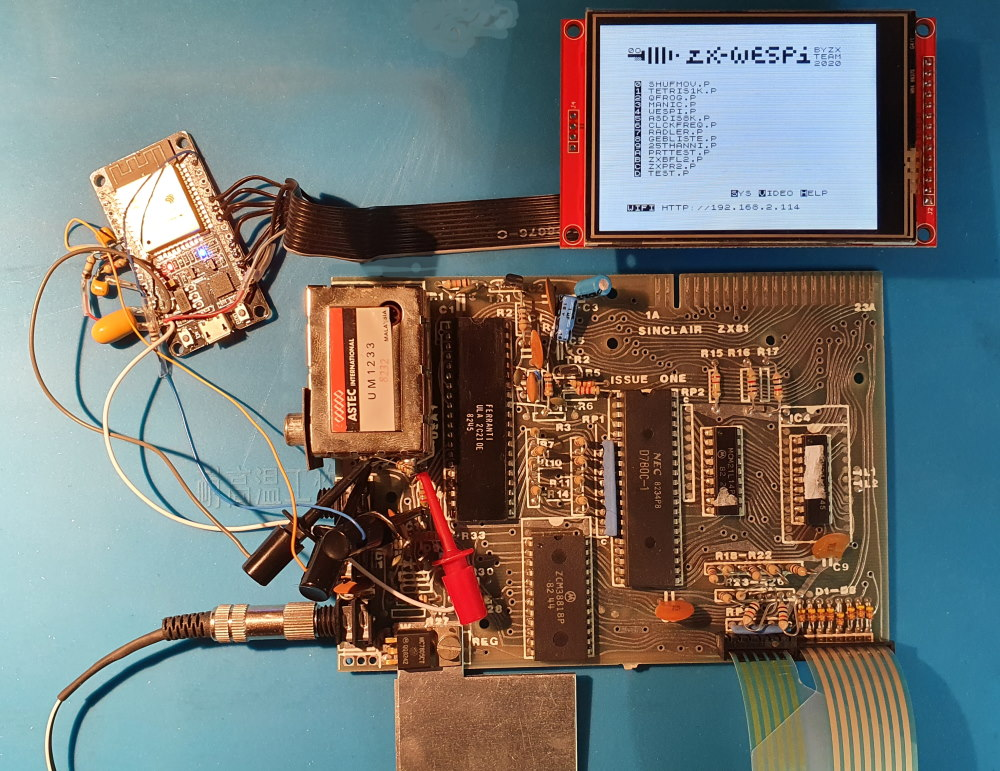
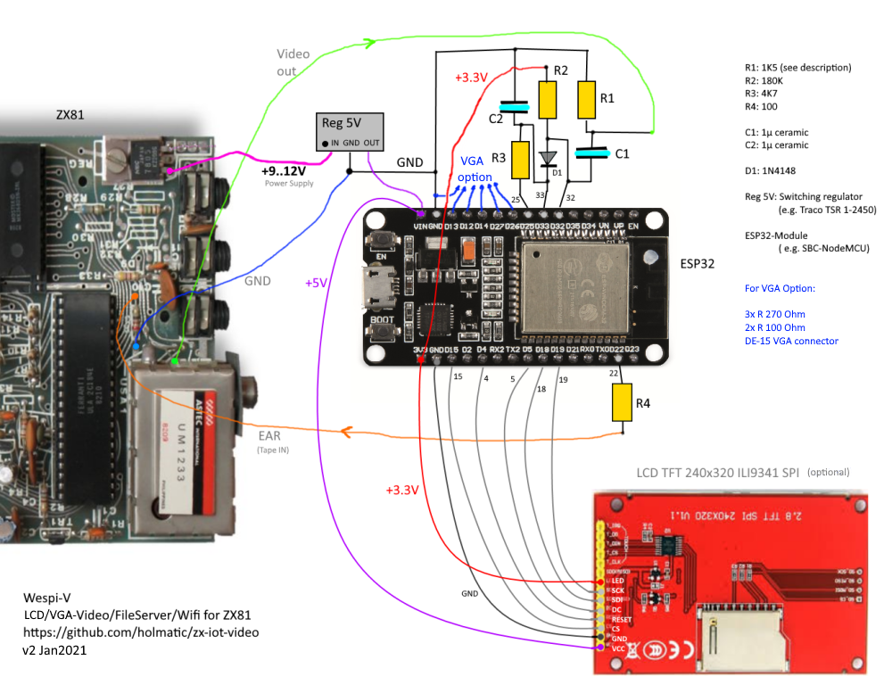

# zx-iot-video

This project creates the firmware for **ZX-Wespi-V** - a DIY ESP32-based TFT/VGA-video-display-interface and wifi-enabled fileserver for ZX81.
When using a Sinclair ZX81 nowadays, one may look for a more handy replacement of the TV set and cassette recorder. 
Maybe even something that can be built in, and allows to exchange the ZX programs and files via wifi to your modern computer. 

Common modern LCD monitors often get in trouble with the ancient ZX81 video signal, as there is no colour carrier signal that allows the monitor to recognize PAL versus NTSC, and the synchonisation sinals are - lets say a 'bit more dynamic' than on modern devices, so nowadays' displays are offended and show blue screens whenever ZX switches to FAST mode. Wespi-V is ZX-aware, starts up quickly, handles FAST mode gracefully, and shows the expected LOAD/SAVE-stripes.

Components needed for building the device are quite inexpensive (about 20€ in total), and required soldering skills are just classic cables and a few simple components.





## Hardware

ESP32-based modules are often used whenever it comes down to electronics control tasks, combined with wifi communication abilities. Here, the I2S interface of the ESP is used to retrieve the ZX81 video signal - which is, as special feature of the ingenious ZX computers, also used as tape recorder output. ESP32 furthermore feeds the tape input of the ZX computer, so LOAD and SAVE work.




_McKlaud_ kindly provided more professional drawings (great thanks !) : 


### Optional VGA Output _(new!)_ ###

Starting from software version v0.6, a simple VGA interface for  standard monitors is supported. 

For the VGA interface hardware, you need five resistors (3x 270$\Omega$ and 2x 100$\Omega$) and the well-known female-type 15-pin D-subminiature connector. Connect as follows:

```
ESP32                     VGA
Module                    Connector

D13 ----[R 270 Ohm]----  1 (RED)
D12 ----[R 270 Ohm]----  2 (GREEN)
D14 ----[R 270 Ohm]----  3 (BLUE)

D27 ----[R 100 Ohm]---- 13 (HSYNC)
D26 ----[R 100 Ohm]---- 14 (VSYNC)

GND ------------------- 6,7,8,10,5 (GND)
```

 The monitor connection is completely optional, one may use VGA, LCD-TFT, both, or none. 

### Power regulator

ESP32 and TFT-diplay need 5 Volts at about 250mA. Safest variant is an additional switching regulator like outlined in the schematic sketch. If your ZX is already upgraded with a modern regulator or bigger heat sink, you may use the 5V from the ZX81 PCB directly. 

If you use the Wespi as an _external_ device, easiest wasy is of course to just utilize the USB plug as a power supply. 

### When using this device as an external monitor

If you do not want to modify the ZX81 or its case, Wespi-V can also be used as external monitor/interface, connected via
longer cables. In this case, R1 should be a 75 Ohms resistor to act as standard cable impedance termination. Of course, in this case it is required that the ZX is internally equipped with a video mod/amplifier. 


## Version Info

0.6.3 Improvements for older ULA (2C184E) video signal

0.6.0 VGA output support added

0.5.0 Initial pre-release (derived from zx-iot-mi)


## Downloading the firmware to the ESP32 Module

Info for the flash files and initial image download for the ZX-Wespi project:

ZX-Wespi is usually able to do over-the-air (OTA) updates via the webserver user interface. 

However, for the following cases a regular download of the flash image is required:

- When initially setting up a brand new ESP32 for your Zeddy
- If something went really wrong during OTA
- If you want to reuse an ESP32 that was used in a different project

This short instruction is for using the ESP32 download tool (tested with V3.8.5)


- Connect ESP32 to computer via USB or COM as applicable

- Get the download tool, at time of writing available at  <https://www.espressif.com/en/support/download/other-tools>, choose flash_download_tool_v3.8.5 or higher
- Run the tool, go to "Developer Mode", "ESP32", choose "SPI download" tab
- Set up the following files and positions to flash:

  + partition-table.bin     @  0x8000 
  + ota_data_initial.bin    @  0xd000
  + bootloader.bin          @  0x1000
  + zx_iot_video.bin		  @ 0x10000

- For the rest of parameters, use:

  + SPI SPEED 40MHz
  + SPI MODE DIO
  + FLSH SIZE 32MBit  (=4MB)
  + COM: (need to find out, look up in your OS' device manager in case of doubt)
  + BAUD: 460800 (may pick a different baud rate)


- Press start to flash. If the ESP32 does not connect automatically, try holding the BOOT knob and/or EN(reset) 


## Over-the-air (OTA) updates

Once you have the system running and connected to WLAN, incremental firmware updates can be done just using a browser. for this,

- Browse into the ZX-Wespi File Server (IP address as shown on the ZX81 menu screen)
- In the 'Upload File' dialog, choose the file named ```zx_iot_video.bin``` and press upload. The process will take 30-60 seconds, the upload button will change text when done. 
- Afterwards, just reset or power cycle the module. 
  
As an info - Wespi OTA uses double-buffering, so a failed update should not harm.

---

Instruction v1.2
